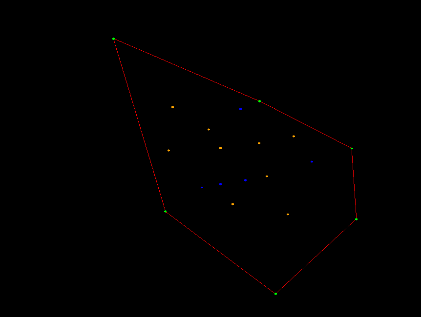
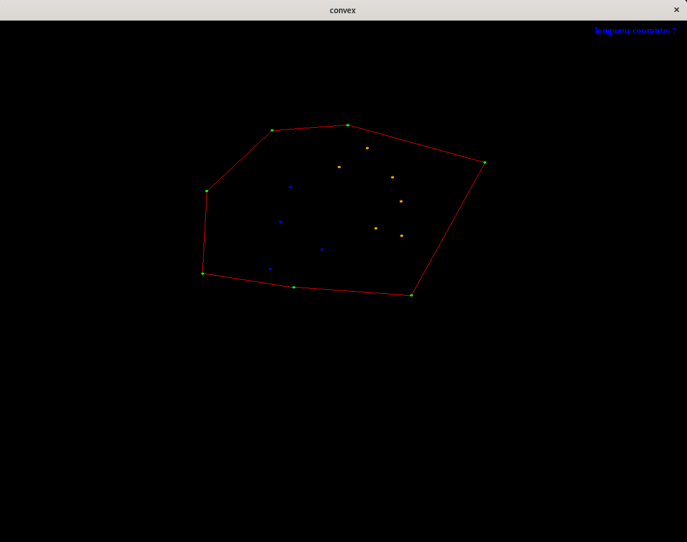
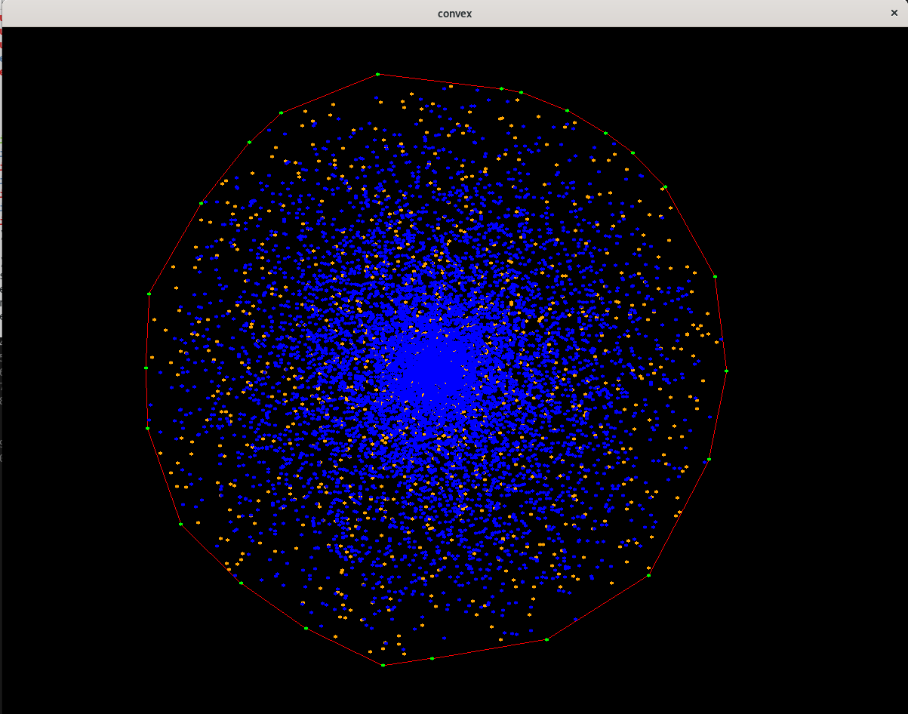
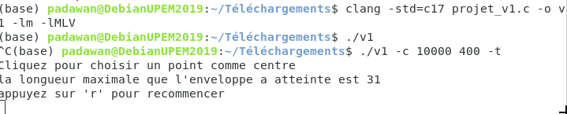
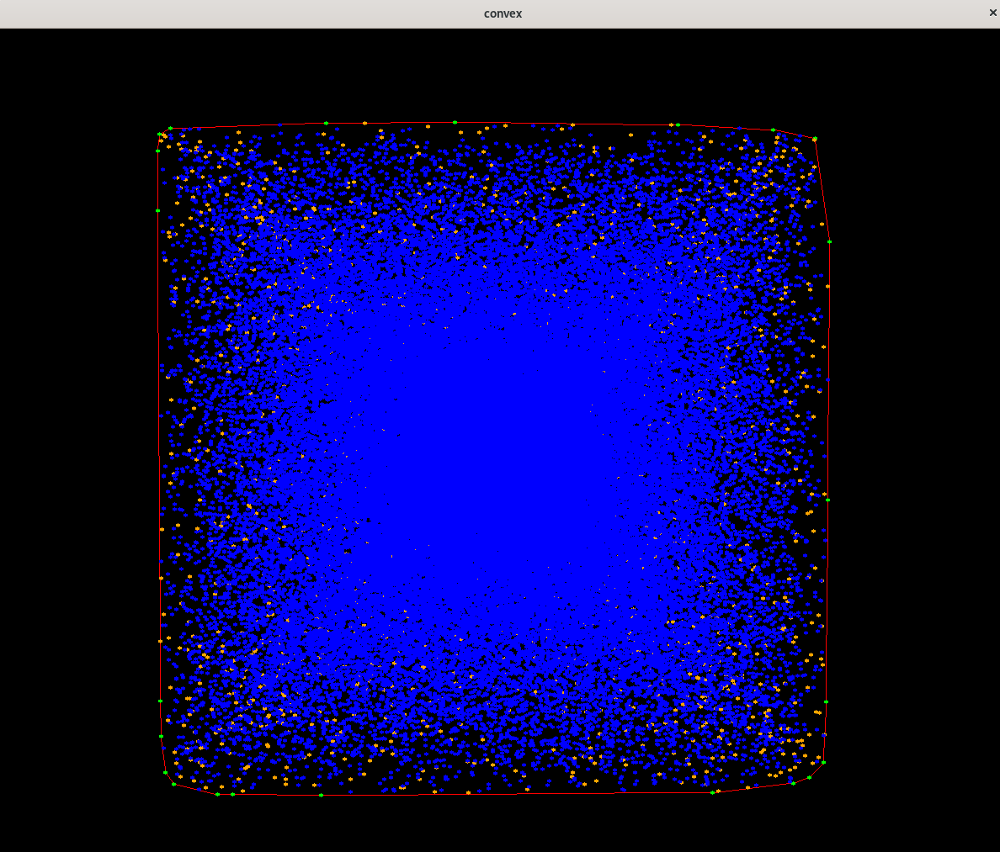
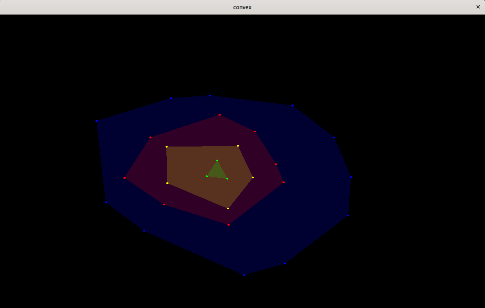
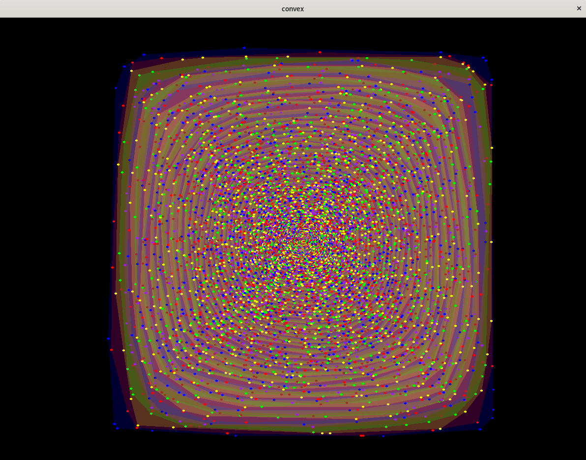
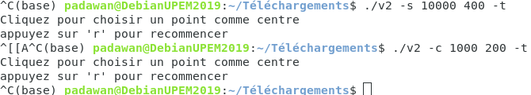
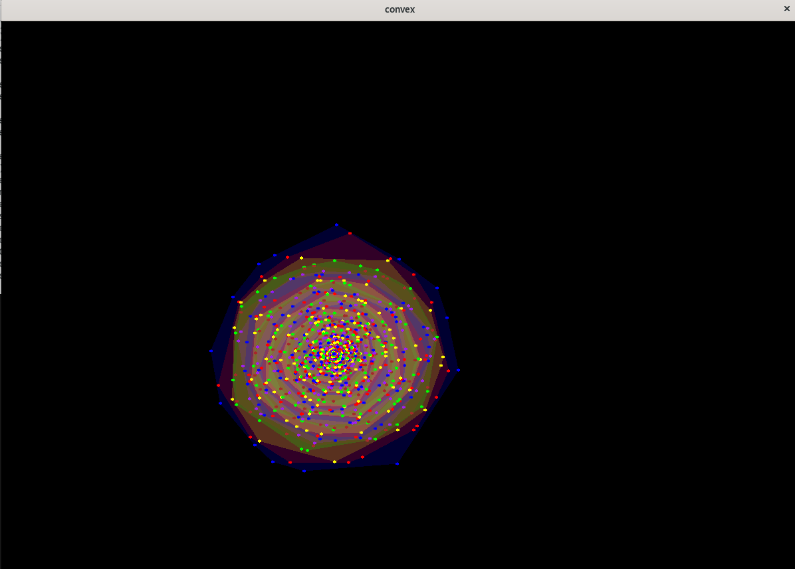

# AZZOUZ Kahina CORBIN Aurelien 


## Information : 

* Groupe de TP : groupe 2 avec Mr Omar Sami OUBBATI
* Groupe de TD : groupe 1 avec Mr Olivier Bouillot 

* Comme option nous avions decider de choisir l'option programation 
___



# Sommaire :
- [Enveloppe Convexe - AZZOUZ Kahina CORBIN Aurelien ](#azzouz-kahina-corbin-aurelien)
  - [Manuel utilisateur](#manuel-utilisateur)
    - [Compilation](#compilation)
    - [Arguments optionnels](#arguments-optionnels)
    - [Jeu](#jeu)
  - [Fonctionnalités](#fonctionnalités)
  - [Divergeances avec l'énnoncé](#divergeances-avec-lénnoncé)
  - [Conclusion](#conclusion)

## Manuel utilisateur

### Compilation

#### Compilation de la premiere version : 

> ```bash
> clang -std=c17 -Wall -Wfatal-errors projet_v1.c -o version1 -lm  -lMLV 
> ```

#### Compilation de la deuxieme version : 
> ```bash
> clang -std=c17 -Wall -Wfatal-errors projet_v2.c -o version2 -lm  -lMLV 
> ```

### Arguments optionnels 

> aucun argument  :
> ```bash
> ./version1 []
> ```
> une fenetre s'ouvre et l'utilisateur peut cree une enveloppe en cliquant a la souris pour determiner les sommets de cette derniere 

> Génération d'une enveloppe qui evolue (grandis) sous la forme d'un carre d'un rayon donne 
> ```bash
> ./version1 [-s nb r] 
> ```
> où `s` signifie square (carre), `nb` est une valeur numerique representant le nombre de point aleatoire  et `r` le rayon du carre .
> Il faut que le nombre de points `nb` soit superieur à `r`.

> Génération d'une enveloppe qui evolue (grandis) sous la forme d'un cercle d'un rayon donne 
> ```bash
> ./version1 [-c nb r] 
> ```
> où `c` signifie circle (cercle), `nb` est une valeur numerique representant le nombre de point aleatoire  et `r` le rayon du carre .
> Il faut que le nombre de points `nb` soit superieur à `r`.

Les arguments ci-dessus ne peuvent pas être combinés .
Le programme peut être lancé sans arguments, ou bien avec l'une des deux options (cercle ou carre) il faut imperativement fournir le nombre de point souhaite et le rayon r .

> Un 4eme argument optionnel permet de choisir le mode dynamiqe ou terminal pour l'affichage par defaut l'affichage se fait de maniere dynamique :
> ```bash
> ./version1 [-t -c nb r]
> ```
> ```bash
> ./version1 [-s nb r -d]
> ```
> cet argument peut etre rajouter au debut ou a la fin mais ne sera pas accepter au milieu entre la declaration de la forme le nombre de point et le r de plus cet argument ne sert a rien si l'on utilise la version de creation d'une enveloppe a la main car l'affichage ne peut etre que dynamique dans ce cas .
>`t` signifie terminal et `d` signifie dynamique .


## Remarque : 
Les memes argument existent pour a version 2 (l'option) et s'applique de la meme maniere 
## Jeu

Les règles sont relativement simple et classiques .

Une fois le programme lancé, l'utilisateur peut interargir avec la souris :
* Le `clique souris` permet de rajouter un point qui peut devenir un nouveau sommet ou simplement faire parti des points qui sont a l'interieur de l'enveloppe convex Ceci etant dans le cas standard de la creation de l'enveloppe a la main .
* dans le cas de la creation aleatoire de lenveloppe sous une certaine forme il suffira de rentrer toujours avec un `clique souris` un centre et de laisser la nagie operer bien sur le point devrais etre choisie intelligement de maniere a ce que l'enveloppe ne sort pas de la fenetre dans le cas contraire on redemande a l'utilisateur de saisir un nouveau centre .
* A la fin du programme avant de fermer la fenetre un clic sur la touche du clavier `r` permet de recommencer et de jouer a nouveau sur le meme exemple que le precent et ceci est valable pour les deux version et dans le cas de la creation a la souris ainsi que celui de la creation aleatoire de l'enveloppe selon une certaine forme .


## Fonctionnalités

Les fonctionnalités sont :
* Affichage
  * L'utilisateur peut décider d'avoir un affichage terminal ou dynamique et cela quel que soit la version , l'affichage terminal est nottament tres apprecie lorsqu'il s'agit d'un nombre tres important de point a traiter .
* Recommencer
  * L'utilisateur peut recommencer à n'importe quel moment sa partie. La fenetre redevient noir et tout redevient à son stade initial, mais l'utilisateur n'aura tout de meme pas besoin de relancer le programme une nouvelle fois .
* Quitter
  * L'utilisateur peut quitter soit en cliquant sur une touche du clavier autre que le `r`, soit en se servant de la `X` croix en haut de la fenêtre.
* information 
  * En haut a droite on peut retrouver la taile courante de l'enveloppe autrement dit le nombre de sommet du polygone et a la fin du programme sur le terminal on peut lire la longeur maximal que l'enveloppe a atteint . 

## Remarque : 
* Afin de mieux comprendre dans la version 1 : la couleur verte est utilise pour les sommeets de l'enveloppe le bleu pour les points qui initialement sont a l'interieur de l'enveloppe et l'orange a ete utiliser pour les point ayant appartenue a l'enveloppe mais qui n'y appartiennent plus .
* Dans la deuxieme version le nuage d'enveloppe super pose les unes sur les autres peut etre tres dense pour differencer les sommets et attribuer a chacun d'entre eux son enveloppe on se contente de leur attribuer la meme couleur que l'enveloppe a la quel ils appartienent .

## Divergeances avec l'énnoncé

*  defaut de cree un menu permettnt de selectionner les options nous avons fait en sorte que ce choix se fasse lors du lancement du programme avec des arguments en plus sur la ligne de commande et non un menu MLV 
* n'ayant pas compris comment generer une documentation du code grâce à l’outil doxygen je me suis contenter de suivre l'exemple avec des commentaire a certain endroit pluot .

## Exemple :


### Premiere partie :

* Voici ce a quoi ressemble la premiere partie version souris : 

* Voici a quoi ressemble la premiere partie  si l'on choisie l'option -c 10000 400 -t :

* Ainsi qu'un exemple des messages afficher sur le terminal qui permettent d'interagir avec l'utilisateur .

* Voici a quoi ressemble la premiere partie  si l'on choisie l'option -s 10000 400 -t :


### Place a la partie option : 

* Voici ce a quoi ressemble l creation du nuage d'enveloppe a la main version souris : 

* Voici ce que l'on obtient si l'on choisie l'option -s 10000 400 -t :

* Ainsi qu'un exemple des messages afficher sur le terminal qui permettent d'interagir avec l'utilisateur .

* Voici a quoi ressemble l'affichage si l'on compile la version 2 (l'option) et que l'on choisie l'option -c 1000 200 -t :


## Conclusion

Globalement, nous avons bien aimé le sujet Bien qu'il nous a vachement occuper pendant la majorite des vacances . (le sujet etais bien claire bien que nous avons mal compris la partie qui concerne le pdf et ce qu'on devrais y ecrire ). La partie graphique nous permettant de visualiser le resultat est satisfaisante bien que la complexite du probleme ne dois pas etre opptimale en vue de l'utilisation du tableau de points bien que nous avions trouver cela necessaire .
___
AZZOUZ Kahina CORBIN Aurelien                   